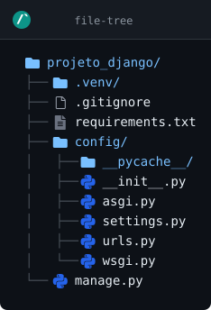
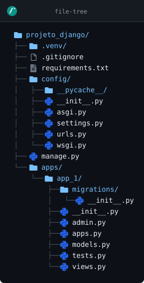
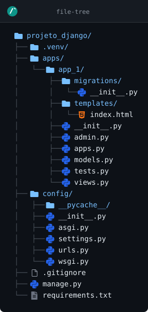
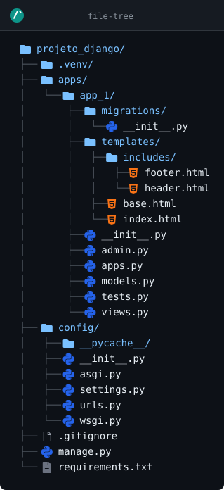

# Django

[Clique aqui para retornar](https://github.com/dev-alexmachado/guia_rapido_python)

## Versão


### SGBD


## Sumário

1. [Instrodução](#introdução)
2. [Estrutura do Django](#estrutura-do-django)<br>
    2.1 [Projeto](#projeto)<br>
    2.2 [Aplicação](#aplicação)<br>
    2.3 [Como esses conceitos se combinam](#como-esses-conceitos-se-combinam)<br>
    2.4 [Em qual conceito ela é baseada](#em-qual-conceito-ela-é-baseada)<br>
    2.5 [Por que esse padrão é útil](#por-que-esse-padrão-é-útil)<br>
3. [Instalação](#instalação)
4. [Novo Projeto](#novo-projeto)<br>
    4.1 [Estrutura de pastas](#estrutura-de-pastas)<br>
    4.2 [Para testar a aplicação](#para-testar-a-aplicação)
5. [Conectar com o banco de dados](#conectar-com-o-banco-de-dados)<br>
    5.1 [SQLite](#sqlite)<br>
    5.2 [MySQL](#mysql)<br>
    5.3 [Configurando dois bancos diferentes no projeto](#configurando-dois-bancos-diferentes-no-projeto)<br>
    5.4 [Migrações](#migrações)<br>
    5.5 [Estabelecendo conexão com o banco](#estabelecendo-conexão-com-o-banco)<br>
6. [Superuser](#superuser)
7. [Novo app](#novo-app)<br>
    7.1 [Instalando aplicação no projeto](#instalando-aplicação-no-projeto)<br>
8. [MTV](#mtv)<br>
    8.1 [Model](#model)<br>
    8.2 [Template](#template)<br>
    8.3 [View](#view)<br>
9. [CRUD](#crud)<br>
    9.1 [Create: criar/cadastrar](#create-criarcadastrar)<br>
    9.2 [Read: pesquisar/listar](#read-pesquisarlistar)

## Introdução

> [!NOTE]
> Django é o principal framework web para Python. É usado para a criação de grandes sistemas web. Um único projeto é capaz de comportar várias aplicações diferentes unidas por um gigantesco ecosistema, incluindo Banco de Dados, Segurança e APIs.

## Estrutura do Django

A estrutura de um projeto Django é baseada em dois conceitos principais:

1. **Projeto** ou **Core** (`project`)
2. **Aplicação** (`app`)

Sendo que o Projeto/Core gerencia a configuração de todos os apps pertencentes ao projeto:
~~~mermaid
mindmap
    root((**Projeto/Core**))
        App 1
        App 2
        App 3
        App 4
~~~

### Projeto
O projeto é a configuração global que reúne as aplicações, URLs, configuração de banco de dados, middlewares, templates, etc.

Normalmente ele contém:
- `manage.py` — comando de controle do Django
- pasta do projeto (ex: `nome_do_projeto/`) com:
  - `settings.py` — configurações do projeto
  - `urls.py` — roteamento das URLs principais
  - `wsgi.py` / `asgi.py` — ponto de entrada para servidores web
  - `__init__.py`

### Aplicação
Uma aplicação é uma parte específica do sistema, com responsabilidade clara.

Cada app costuma ter:
- `models.py` — definição dos dados / tabelas
- `views.py` — lógica que responde a requisições
- `urls.py` — rotas internas da app (opcional mas comum)
- `templates/` — arquivos HTML
- `static/` — arquivos CSS, JS, imagens
- `admin.py` — cadastro no painel administrativo
- `apps.py` — configuração da app
- `tests.py` — testes automatizados

### Como esses conceitos se combinam
- um projeto pode ter várias apps
- cada app é reutilizável e independente
- o projeto conecta todas as apps e define o fluxo geral

### Em qual conceito ela é baseada
A estrutura do Django é baseada no padrão:
- **MTV** (Model-Template-View), uma variação do MVC

Onde:
- `Model` = dados e regras de negócio (`models.py`)
- `Template` = apresentação/HTML (`templates/`)
- `View` = lógica que processa a requisição e escolhe o template (`views.py`)

### Por que esse padrão é útil
- separa responsabilidades
- facilita organizar código em partes claras
- torna o projeto escalável
- ajuda a manter apps reutilizáveis

> [!TIP]
> Resumindo: um projeto Django é composto por um “contêiner” de configuração e por várias aplicações pequenas, seguindo uma arquitetura baseada em MTV para separar dados, lógica e apresentação.

## Instalação

Para instalar o Django, certifique-se de que a venv esteja criada e ativada, e então digite no terminal:
~~~
pip install django
~~~

Caso não tenha a venv criada:
~~~
py -m venv .venv
.venv\Scripts\activate
pip install django
~~~

## Novo Projeto

Para criar um novo projeto, seguem as opções:
1. Para criar um projeto na pasta da venv:
~~~
django-admin startproject nome_do_projeto
~~~
2. Ou para transformar a pasta onde se encontra a venv no próprio projeto:
~~~
django-admin startproject nome_do_projeto .
~~~

> [!NOTE]
> O ideal é seguir o seguinte passo a passo para a criaão de um novo projeto Django:
> 1. Crie manualmente uma pasta com o nome do projeto.
> 2. Crie a venv.
> 3. Instale o Django.
> 4. Crie um novo projeto Django com o nome `core` ou `config`, para manter o padrão utilizado no mercado, já que a pasta do projeto irá centralizar as configurações dos apps, utilizando o comando `django-admin startproject config .` ou `django-admin startproject core .`, por exemplo.

Sequencia para quem não criou a venv e para seguir o padrão do mercado:
~~~
py -m venv .venv
.venv\Scripts\activate
pip install django
django-admin startproject config .
~~~

### Estrutura de pastas

Ao criar o novo projeto Django, a estrutura de pastas deverá ficar mais ou menos assim:
```
projeto_django/
├── .venv/
├── .gitignore
├── requirements.txt
├── config/
│   ├── __pycache__/
│   ├── __init__.py
│   ├── asgi.py
│   ├── settings.py
│   ├── urls.py
│   └── wsgi.py
└── manage.py

```
[](https://www.readmecodegen.com/file-tree/create-folder-structure-online)

### Para testar o projeto

> [!WARNING]
> Diferentemente dos outros programas Python, aqui a execução da aplicação não acontece ao abrir o arquivo principal e apertar `Ctrl+F5`. Continue lendo para ver como executar uma aplicação Django.

1. Execute o comando abaixo para iniciar o servidor:
~~~
py manage.py runserver
~~~
2. Isso irá startar o servidor local na porta **8000**. Abra o navegador de sua preferência e acesse **http://localhost:8000**.

Se tudo der certo, o navegador irá mostrar uma tela com um foguete e um texto mostrando que o Django está funcionando corretamente.

A sequência de comandos para sair do zero e chegar até a hora de abrir o navegador é:
~~~
py -m venv .venv
.venv\Scripts\activate
pip install django
django-admin startproject nome-do-projeto
cd nome-do-projeto
py manage.py runserver
~~~

Ou
~~~
py -m venv .venv
.venv\Scripts\activate
pip install django
django-admin startproject nome-do-projeto .
py manage.py runserver
~~~

## Conectar com o banco de dados

> [!TIP]
> Ao instalar o Python no seu computador, ele também instala junto um SGBD pronto para ser usado por qualquer programa que você criar, seja ele escrito em Python ou não: o **SQLite**.<br>
> O SQLite é um "micro SGBD", que comporta poucos dados em comparação com outros SGBDs, como o MySQL e o PostgreeSQL, sendo mais recomendado para testar sistemas, ou para aplicações de pequeno porte.<br>
> Ele é muito usado no mercado, pois tem a vantagem de criar um arquivo `.db` ou `sqlite3` que funciona como um micro servidor dentro da própria aplicação, diferentemente de outros SGBDs que exigem conexão com um servidor.

Dentro da pasta do projeto, abra o arquivo `settings.py` e procure por `DATABASES` (provável linha 75). Ele é um dicionário com o seguinte código:
~~~python
DATABASES = {
    'default': {
        'ENGINE': 'django.db.backends.sqlite3',
        'NAME': BASE_DIR / 'db.sqlite3',
    }
}
~~~

Esta parte do código é o responsável por configurar o banco de dados do seu projeto. Veja como fazer isso logo abaixo:

### SQLite

Caso opte por usar o SQLite no seu projeto, altere a linha 78, de `'NAME': BASE_DIR / 'db.sqlite3',` para `'NAME': BASE_DIR / 'banco_do_projet.db',` ou então para `'NAME': BASE_DIR / 'banco_do_projet.sqlite3',`. O código ficará mais ou menos assim:
~~~python
DATABASES = {
    'default': {
        'ENGINE': 'django.db.backends.sqlite3',
        'NAME': BASE_DIR / 'banco_do_projeto.db',
    }
}
~~~

### MySQL

Caso opte por usar o MySQL, precisará alterar todo o dicionário do `DATABASES`. Veja o código para usar o MySQL:
~~~python
DATABASES = {
    'default': {
        'ENGINE': 'django.db.backends.mysql',
        'NAME': 'nome_do_banco',
        'USER': 'usuario',
        'PASSWORD': 'senha',
        'HOST': 'localhost',
        'PORT': '3306',
    }
}
~~~

> [!CAUTION]
> As informações acima consideram o servidor do banco de dados sendo executado localmente com a porta padrão. Altere os dados de acordo com a configuração do seu MySQL.

Além disso, será necessário instalar o ***driver*** do MySQL no seu projeto. Abra o terminal no diretório da venv que seu projeto usa, e execute o comando:
~~~
pip install mysqlclient
~~~

> [!IMPORTANT]
> A configuração do `DATABASES` e o comando de instalação do driver muda dependendo do SGBD escolhido para o seu projeto. Consulte as informações necessárias caso o SGBD que for usar seja diferente dos utilizados neste guia.

### Configurando dois bancos diferentes no projeto

> [!TIP]
> É possível configurar dois bancos diferentes ou mais simultâneamente no mesmo projeto, o que pode ser muito útil para várias ocasiões, como migração de banco, por exemplo.

Para configurar, por exemplo, um banco SQLite e um MySQL no mesmo projeto:
~~~python
DATABASES = {
    "default": {
        "ENGINE": "django.db.backends.sqlite3",
        "NAME": BASE_DIR / "banco_do_projeto.db",
    },
    "mysql": {
        "ENGINE": "django.db.backends.mysql",
        "NAME": "nome_do_banco",
        "USER": "usuario",
        "PASSWORD": "senha",
        "HOST": "localhost",
        "PORT": "3306",
    },
}
~~~

> [!IMPORTANT]
> Lembre-se de que para cada SGBD diferente que for usar, será necessário instalar seu driver. Procure saber qual comando específico deverá ser usado para instalá-lo no seu projeto.

### Migrações

> [!CAUTION]
> Quando uma alteração que influencia no banco de dados é feita, é necessário executar a migração para que as alterações sejam aplicadas no banco.

Para migrar as alterações para o banco de dados, execute no terminal dentro da pasta raiz do projeto:
~~~
py manage.py makemigrations
~~~

Em seguida, execute no terminal:
~~~
py manage.py migrate
~~~

A sequencia correta é:
~~~
py manage.py makemigrations
py manage.py migrate
~~~

### Estabelecendo conexão com o banco

Para conectar seu projeto com o banco, basta rodar o servidor do Django, abrindo o terminal no diretório raiz do seu projeto e executando o comando:
~~~
py manage.py runserver
~~~

> [!WARNING]
> Lembre-se de que antes de ligar o servidor do Django, o servidor do banco de dados deverá já estar ligado também.<br>
> A exceção a regra é para o SQLite, em que não há necessidade de ligar outro servidor antes. Ao executar o comando no terminal, ele gerará um arquivo na raíz do projeto com o nome configurado em `DATABASES`.

## Superuser

> [!TIP]
> O Django já vem com um sistema de administração do projeto pronto, com tela de login e gerenciamento das entidades do banco, que permite criar novas entidades, e até mesmo fazer o CRUD completo em todas elas. Para que isso seja possível, é necessário a criação de um usuário administrador, que chamamos de **Superuser**.

Para criar o **superuser**, abra o terminal na pasta raiz do projeto e execute:
~~~
py manage.py createsuperuser
~~~

Ele irá pedir para criar um nome para o **admin**, e uma **senha** (não esqueça a senha). Defina essas informações e confirme com `y` quando solicitado.

Se tudo tiver dado certo, abra o navegador e acesse o endereço **http://localhost:8000/admin** para ir para uma tela de login e senha. Use o login e senha definidos no passo anterior para ir para a tela de administração do sistema, onde você terá acesso direto e irrestrito às tabelas do banco (você pdoerá criar tabelas diretamente dessa tela, se desejar).

> [!IMPORTANT]
> A criação do **superuser** só dará certo se antes o sistema tiver estabelecido conexão com o banco de dados previamente configurado, e também se tiver sido executado a migração. A ordem correta dos comandos é:
> ~~~
> py manage.py makemigrations
> py manage.py migrate
> py manage.py createsuperuser
> py manage.py runserver
> ~~~

## Novo app

Como dito anteriormente, ao criar um novo projeto Django, você estará apenas criando seu núcleo. Será necessário criar dentro desse projeto um **app**, lembrando que um único projeto pode ter vários apps.

Para criar um novo app dentro do seu projeto, abra o terminal no diretório raiz do projeto, e execute:
~~~
py manage.py startapp nome_do_app
~~~

Ele irá criar um novo diretório dentro do projeto, com novos arquivos e nova estrutura. É nela que iremos definir as **Models** e o **Front-End** da sua aplicação, caso seu projeto tenha apenas um único app.

> [!TIP]
> Para organizar melhor a estrutura de pastas do seu projeto, como provavelmente você irá criar vários apps dentro dele, crie uma pasta chamada `apps` na raíz do projeto, fora da pasta do core da aplicação. Ao criar um novo app, use o comando abaixo:
> ~~~
> py manage.py startapp nome_do_app ./apps/nome_do_app
> ~~~

A estrutura de pastas do seu projeto como um todo neste momento deverá ficar assim:
```
projeto_django/
├── .venv/
├── .gitignore
├── requirements.txt
├── config/
│   ├── __pycache__/
│   ├── __init__.py
│   ├── asgi.py
│   ├── settings.py
│   ├── urls.py
│   └── wsgi.py
├── manage.py
└── apps/
    └── app_1/
        ├── migrations/
        │   └── __init__.py
        ├── __init__.py
        ├── admin.py
        ├── apps.py
        ├── models.py
        ├── tests.py
        └── views.py

```
[](https://www.readmecodegen.com/file-tree/create-folder-structure-online)

### Instalando aplicação no projeto

Após criar um novo app, é necessário registrá-lo no **core** do projeto.

Abra o arquivo `settings.py` dentro da pasta do projeto que representa o core, e procure pela lista `INSTALLED_APPS` (provavelmente na linha 33). O código provavelmente estará assim:
~~~python
INSTALLED_APPS = [
    'django.contrib.admin',
    'django.contrib.auth',
    'django.contrib.contenttypes',
    'django.contrib.sessions',
    'django.contrib.messages',
    'django.contrib.staticfiles',
]
~~~

Adicione o seu app nessa lista, digitando `'nome_do_app',`. Ficará assim:
~~~python
INSTALLED_APPS = [
    'django.contrib.admin',
    'django.contrib.auth',
    'django.contrib.contenttypes',
    'django.contrib.sessions',
    'django.contrib.messages',
    'django.contrib.staticfiles',
    'nome_do_app', # novo app
]
~~~

Ou assim:
~~~python
INSTALLED_APPS = [
    'django.contrib.admin',
    'django.contrib.auth',
    'django.contrib.contenttypes',
    'django.contrib.sessions',
    'django.contrib.messages',
    'django.contrib.staticfiles',
    'apps.nome_do_app', # novo app
]
~~~

> [!WARNING]
> Se caso você tiver criado seu app dentro da pasta `apps` sugerida anteriormente, use em `INSTALLED_APPS` o código `apps.nome_do_app` ao invés de `nome_do_app`.<br>
> Se mesmo assim o sistema não reconhecer o app, abra o arquivo `apps.py` dentro da pasta da aplicação em questão, e altere o comando `name = 'nome_do_app'` para `name = apps.nome_do_app`, e acrescente `default_auto_field = 'django.db.models.BigAutoField'` no `class`. Ficará assim:
> ~~~python
> from django.apps import AppConfig
>
>
> class ChatAppConfig(AppConfig):
>     default_auto_field = 'django.db.models.BigAutoField'
>     name = 'apps.nome_do_app'
> ~~~

## MTV

**MTV** (por vezes chamado também de **MVT**) significa **Model-Template-View**. É uma variação do famoso **MVC** (**Model-View-Controller**):
- **Model**: faz parte do back-end da aplicação. É onde ficam os dados e as regras de negócio.
- **View**: diferentemente do MVC, aqui a view não é o Front-End. É a lógica que processa a  requisição e escolhe o template.
- **Template**: é a camada de apresentação, onde no MVC seria a view. Em outras palavras: é onde fica o Front-End da aplicação.

### Model

Aqui se criam as classes que irão representar as entidades do banco. Abra o arquivo `models.py` dentro da pasta do app. Ela terá por padrão esse código:
~~~python
from django.db import models

# Create your models here.
~~~

Para criar uma model, vamos usar como exemplo uma classe chamada `Pessoa`, que irá herdar a classe `Model` que já vem pronta dentro do Django:
~~~python
from django.db import models

class Pessoa(models.Model):
    id_pessoa = id_pessoa = models.AutoField(primary_key=True)
    nome = models.CharField(null=False, blank=False)
    email = models.EmailField(unique=True, null=False, blank=False)
    cpf = models.CharField(max_length=14, unique=True, null=False, blank=False)
    altura = models.DecimalField(max_digits=5, decimal_places=2, null=True, blank=True)
    data_nascimento = models.DateField(null=False, blank=False)

    def __str__(self):
        return self.nome
~~~


Depois, registre sua nova model no app. Abra o arquivo `admin.py`, que deverá estar com o seguinte código:
~~~python
from django.contrib import admin

# Register your models here.
~~~

Adicione a sua nova model aqui. O código para adicionar a model feita anteriormente neste guia é:
~~~python
from django.contrib import admin
from .models import Pessoa

admin.site.register(Pessoa)
~~~

A nova model precisa ser registrada no banco de dados como uma nova entidade, e no momento não está. Será necessário rodar novamente a migração. Abra o terminal na pasta raiz do projeto e execute os comandos de migrarção para atualizar o banco de dados:
~~~
py manage.py makemigrations
py manage.py migrate
~~~

Se tudo tiver dado certo, rode a aplicação com `py manage.py runserver` e acesse no navegador **http://localhost:8000/admin**, logando com o usuário e senha do admin, e veja na página de administração do projeto Django que a nova entidade já se encontra disponível e pronta para uso.

### Template

Em termos simples, é o Front-End da aplicação. Abra a pasta do app, e crie dentro dela duas novas pastas: `templates` e `static`:
- `templates`: onde ficarão todos os arquivos HTML, e somente os arquivos HTML.
- `static`: onde ficarão qualquer arquivo de suporte ao HTML: css, js, imagens, audio, video, fonts, etc...

Crie um arquivo simples chamado `index.html` dentro de `templates` com o seguinte código:
~~~html
<!DOCTYPE html>
<html lang="pt-br">
<head>
    <meta charset="UTF-8">
    <meta name="viewport" content="width=device-width, initial-scale=1.0">
    <title>Aplicação Django</title>
</head>
<body>
    <h1>Home Page da aplicação Django!</h1>
    <!-- Conteúdo da página inicial -->
</body>
</html>
~~~

Ao fazer esse procedimento, a estrutura de pastas ficará assim:
```
projeto_django/
├── .venv/
├── apps/
│   └── app_1/
│       ├── migrations/
│       │   └── __init__.py
│       ├── templates/
│       │   └── index.html
│       ├── __init__.py
│       ├── admin.py
│       ├── apps.py
│       ├── models.py
│       ├── tests.py
│       └── views.py
├── config/
│   ├── __pycache__/
│   ├── __init__.py
│   ├── asgi.py
│   ├── settings.py
│   ├── urls.py
│   └── wsgi.py
├── .gitignore
├── manage.py
└── requirements.txt

```
[](https://www.readmecodegen.com/file-tree/create-folder-structure-online)

Agora, precisaremos da **view** para fazer o Django reconhecer e executar esse arquivo.

### View

É na view que iremos processar a requisição e escolher os arquivos do template que serão lidos.

Dentro da pasta do seu app, existe um arquivo chamado `views.py`. Abra-o, e você provavelmente irá ver este código:
~~~python
from django.shortcuts import render

# Create your views here.
~~~

Para o projeto Django reconhecer o HTML, acrescente neste arquivo o código abaixo:
~~~python
from django.shortcuts import render
from django.http import HttpResponse

def index(request):
    return render(request, "index.html")
~~~

Ainda dentro da pasta do app, crie um novo arquivo chamado `urls.py`. Dentro desse arquivo, deverá ter este código:
~~~python
from django.urls import path
from . import views

urlpatterns = [
    path('', views.index, name='index'),
]
~~~

Este arquivo irá traçar a rota para acessar o arquivo HTML que servirá de Home Page da aplicação.

Dentro da pasta do core do projeto, já existe um outro arquivo também chamado de `urls.py`. Além de um comentário de múltiplas linhas, ele virá com o seguinte código:
~~~python
from django.contrib import admin
from django.urls import path

urlpatterns = [
    path('admin/', admin.site.urls),
]
~~~

Vamos alterar este código para registrar também a rota para a Home Page da nossa aplicação. Adicione à lista `path('', include('nome_do_app.urls')),` e importe o `include` a partir de `django.urls`. O código do arquivo ficará assim:
~~~python
from django.contrib import admin
from django.urls import path, include

urlpatterns = [
    path('admin/', admin.site.urls),
    path('', include('nome_do_app.urls')),
]
~~~

Ou então:
~~~python
from django.contrib import admin
from django.urls import path, include

urlpatterns = [
    path('admin/', admin.site.urls),
    path('', include('apps.nome_do_app.urls')),
]
~~~

Ao termniar, já pode testar para ver se o Django reconhece o HTML como Home Page da sua aplicação. Rode `py manage.py runserver` e acesse no navegador **http://localhost:8000** para ver se a página padrão do Django foi trocada pela página que você criou.

> [!IMPORTANT]
> Assim como o Flask, o Django também possui suporte ao Jinja. Logo, os mesmos comandos do Jinja feitos no Flask podem ser feitos também no Django.

Dito isso, segue a mesma estrutura de modularização do Flask, que também funciona aqui. Basta salvar os arquivos HTML dentro da pasta `templates` no diretório do app:

`base.html`:
~~~html
<!doctype html>
<html lang="pt-br">
  <head>
    <meta name="author" content="Alex Machado Ribeiro">
    <meta charset="utf-8">
    <meta name="viewport" content="width=device-width, initial-scale=1">
    <title>Aplicação Django</title>
  </head>
  <body>
    
    <main>
        
    </main>
    
  </body>
</html>
~~~

`header.html`:
~~~html
<header>
    <a href="/">Home page</a> |
    <a href="/outraPagina">Outra Página</a>
</header>
~~~

`footer.html`:
~~~html
<footer>
    <p>© Copyright - Todos os direitos reservados.</p>
</footer>
~~~

`index.html`:
~~~html

Home Page

    <h1>Seja bem vindo à Home Page do sistema Django! 😎</h1>

~~~

Nessa etapa, a estrutura de pastas e arquivos deverá ficar assim:
```
projeto_django/
├── .venv/
├── apps/
│   └── app_1/
│       ├── migrations/
│       │   └── __init__.py
│       ├── templates/
│       │   ├── includes/
│       │   │   ├── footer.html
│       │   │   └── header.html
│       │   ├── base.html
│       │   └── index.html
│       ├── __init__.py
│       ├── admin.py
│       ├── apps.py
│       ├── models.py
│       ├── tests.py
│       └── views.py
├── config/
│   ├── __pycache__/
│   ├── __init__.py
│   ├── asgi.py
│   ├── settings.py
│   ├── urls.py
│   └── wsgi.py
├── .gitignore
├── manage.py
└── requirements.txt

```
[](https://www.readmecodegen.com/file-tree/create-folder-structure-online)

Abra o terminal no diretório raiz do projeto, execute o servidor com `py manage.py runserver` e acesse no navegador o endereço **http://localhost:8000** para testar.

## CRUD

Já visto anteriormente, mas iremos revisar aqui:
- **Create**: criar/cadastrar.
- **Read**: pesquisar/listar.
- **Update**: editar/atualizar.
- **Delete**: apagar/deletar.

### Create: criar/cadastrar

Abra o arquivo `views.py` no diretório do app e adicione o código conforme descrito abaixo:
~~~python
from django.shortcuts import render, redirect
from django.http import HttpResponse
from .models import Pessoa

def index(request):
    return render(request, "index.html")

# TODO: nova view
def cadastrar_pessoa(request):
    if request.method == 'POST':
        nome = request.POST.get('nome')
        email = request.POST.get('email')
        cpf = request.POST.get('cpf')
        altura = request.POST.get('altura')
        data_nascimento = request.POST.get('data_nascimento')
        Pessoa.objects.create(
            nome=nome,
            email=email,
            cpf=cpf,
            altura=altura,
            data_nascimento=data_nascimento
        )
        return redirect('index')
    return render(request, 'cadastrar.html')
~~~

Adicione dentro da pasta do app o arquivo `cadastrar.html` com o seguinte código:
~~~html

Home Page

    <form method="POST" action="">
        
        <label for="nome">Nome:</label>
        <input type="text" name="nome" required>
        <br>
        <label for="email">Email:</label>
        <input type="email" name="email" required>
        <br>
        <label for="cpf">CPF:</label>
        <input type="text" name="cpf" required>
        <br>
        <label for="altura">CPF:</label>
        <input type="number" step="0.01" name="altura" required>
        <br>
        <label for="data_nascimento">CPF:</label>
        <input type="date" name="data_nascimento" required>
        <br>
        <button type="submit">Cadastrar</button>
    </form>

~~~

Agora abra o arquivo `urls.py` no diretório do app e adicione um novo path:
~~~python
from django.urls import path
from . import views

urlpatterns = [
    path('', views.index, name='index'),
    path('cadastrarPessoa/', views.cadastrar_pessoa, name='cadastrar_pessoa'), # novo path
]
~~~

Agora abra o arquivo `header.html` em `templates`, e edite o link para acessar o formulário de cadastro de pessoas:
~~~html
<header>
    <a href="/">Home page</a> |
    <a href="/cadastrarPessoa">Cadastrar nova pessoa</a>
</header>
~~~

Pronto! Agora é só executar o servidor com `py manage.py runserver` e acessar **http://localhost:8000** para testar a aplicação.

### Read: pesquisar/listar

Para este guia, vamos listar todos os usuários cadastrados na Home Page, ou seja, o nosos `index.html` será o **Read**.

Abra o arquivo `views.py` no diretório do app, e altere a função `index()` conforme código-fonte abaixo:
~~~python
from django.shortcuts import render, redirect
from django.http import HttpResponse
from .models import Pessoa

# REVIEW: altere essa função
def index(request):
    pessoas = Pessoa.objects.all()
    return render(request, "index.html", {"pessoas": pessoas})

# ...função cadastrar_pessoa logo depois desse código...
~~~

Abra o `index.html` em `templates` e faça o seguinte código:
~~~html

Home Page

    <h1>Lista de pessoas</h1>
    <ul>
        
            <li>
                {{ pessoa.id_pessoa }} |
                {{ pessoa.nome }} |
                {{ pessoa.email }} |
                {{ pessoa.cpf }} |
                {{ pessoa.altura }} metros |
                {{ data_nascimento }}
            </li>
        
            <li>Nenhuma pessoa cadastrada.</li>
        
    </ul>

~~~

Execute o servidor com `py manage.py runserver` e acesse **http://localhost:8000** para testar.

---

- [Voltar ao início](#sumário)
- [Voltar ao índice do Guia Rápido de Python](https://github.com/dev-alexmachado/guia_rapido_python)